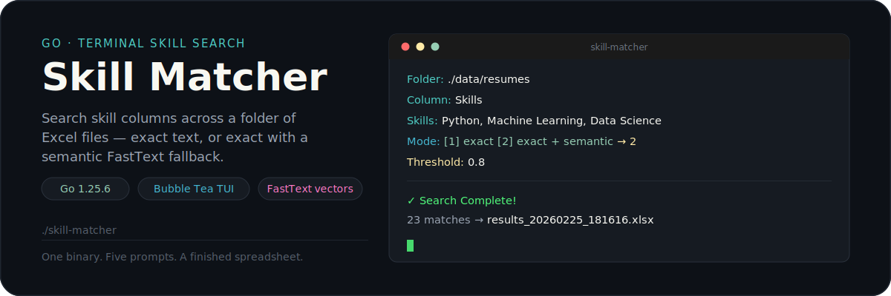
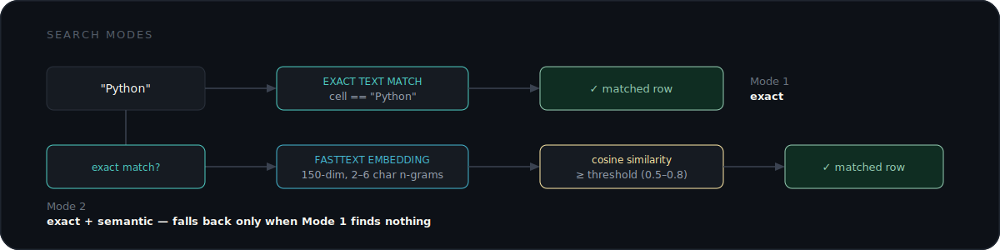
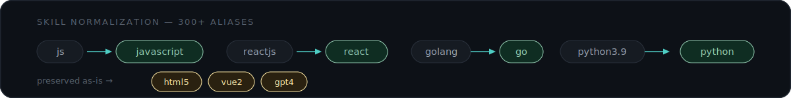

<p align="center">
  
</p>

Skill Matcher scans a folder of Excel files for a skill column and finds matching rows — **exact** text matches, or **exact + semantic** matches using FastText word embeddings. No web UI, no server: answer five prompts in the terminal and get back a filtered `.xlsx`.

## Quickstart

```bash
go build -o skill-matcher
./skill-matcher
```

```text
Folder: ./data/resumes
Column: Skills
Skills: Python, Machine Learning, Data Science
Mode: [1] exact  [2] exact + semantic  → 2
Threshold: 0.8

✅ Search Complete! Output written to results_20260225_181616.xlsx (23 matches found)
```

First run of `exact + semantic` mode downloads a pretrained model (`model.vec`) automatically — no setup required. Train your own only if you want it tuned to your own skill vocabulary (see [Training a custom model](#training-a-custom-model)).

## Features

- **Interactive TUI** — five-step prompt flow built with [Bubble Tea](https://github.com/charmbracelet/bubbletea), no flags to memorize
- **Two search modes** — exact text matching, or exact with a semantic fallback
- **Concurrent processing** — every `.xlsx` file in the folder is scanned in parallel
- **Skill normalization** — 300+ built-in aliases (`js` → `javascript`) with version-aware preservation (`html5`, `vue2`)
- **Zero-setup semantic search** — the pretrained model downloads automatically on first use
- **Custom model training** — extract a skills corpus from your own spreadsheets and train a FastText model tuned to it

## Search modes

<p align="center">
  
</p>

**Exact** — searches the column for a direct text match. Nothing else.

**Exact + Semantic** — tries an exact match first, then, only where nothing matched, falls back to FastText word embeddings and keeps rows whose cosine similarity clears your threshold.

| Threshold | Behavior |
| --- | --- |
| `0.8–1.0` | Very strict, near-identical matches only |
| `0.7–0.8` | High similarity, closely related concepts |
| `0.6–0.7` (recommended) | Moderate similarity, broader matches |
| `0.5–0.6` | Loose, experimental |
| `< 0.5` | Very loose — expect false positives |

## Skill normalization

<p align="center">
  
</p>

Aliases and version stripping live in [`helpers/skillsAlias.go`](helpers/skillsAlias.go) and [`helpers/preserveNumbers.go`](helpers/preserveNumbers.go) — edit those files to add or fix a mapping.

## Installation

1. Clone this repository.
2. Install [FastText](https://github.com/facebookresearch/fastText) if you plan to train a custom model:
   ```bash
   git clone https://github.com/facebookresearch/fastText.git
   cd fastText && make
   ```
3. Install Go dependencies and build:
   ```bash
   go mod tidy
   go build -o skill-matcher
   ```

## Training a custom model

Semantic search works out of the box using an auto-downloaded pretrained model. Train your own instead if your skill vocabulary is domain-specific and the default model misses too many matches.

```bash
cd skillExtractor
# edit the folder path in main.go to point at your Excel files
go run main.go              # writes skills_corpus.txt

cd train
# edit the fasttext binary path in main.go — it's hardcoded to a local path
go run main.go               # writes skill_model.vec / skill_model.bin
```

Copy or rename the resulting `skill_model.vec` to `model.vec` in the directory you run `./skill-matcher` from — that's the fixed path the app loads. The generated files are gitignored (large, and specific to your data) — you regenerate them locally, you don't commit them.

Model shape: skip-gram, 150 dimensions, 8-word context window, 2–6 character n-grams, 15 epochs, 15 negative samples, learning rate 0.05.

## Dependencies

- [Bubble Tea](https://github.com/charmbracelet/bubbletea) — TUI framework
- [Bubbles](https://github.com/charmbracelet/bubbles) — TUI components
- [Lipgloss](https://github.com/charmbracelet/lipgloss) — styling
- [Excelize](https://github.com/xuri/excelize) — Excel file I/O

## File structure

```text
skill-matcher/
├── main.go               # entry point
├── tui.go                 # terminal prompt flow
├── search.go               # exact + semantic search
├── model.go                 # word embedding loading
├── downloader.go / downloader_tui.go  # auto-downloads the pretrained model + progress UI
├── index.go                 # gob row cache (currently unused)
├── helpers/
│   ├── skills.go             # normalization logic
│   ├── skillsAlias.go          # 300+ alias mappings
│   └── preserveNumbers.go       # version preservation rules
└── skillExtractor/
    ├── main.go                # corpus extraction from Excel
    └── train/main.go            # FastText training
```

## Troubleshooting

**Model download fails** — semantic mode auto-downloads `model.vec` from Hugging Face on first run; check your network, or supply your own by placing a trained `model.vec` in the directory you run the app from.

**Column not found** — column names are case-sensitive and must match exactly.

**No results** — lower the threshold, or switch to exact mode to debug what's actually in the column.

**High memory use** — word vectors are loaded fully into memory for semantic search; make sure you have room for `model.vec`.

## Contributing

Fork, branch, make your change, open a PR.
